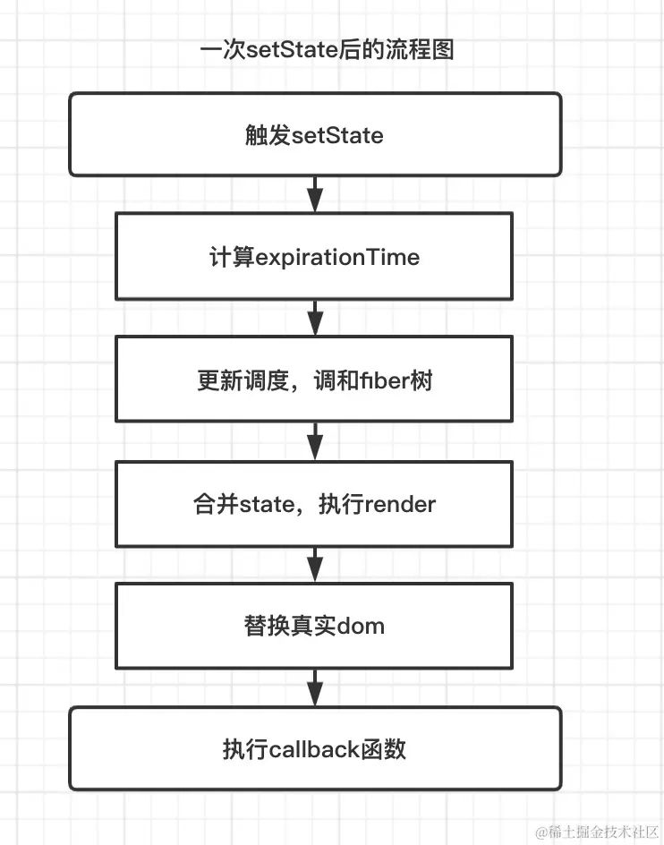

# react 

css 模块化 中 :global 使用

```scss
@keyframes rotate {
    0% {
      transform: rotate(0)
    }

    100% {
      transform: rotate(360deg)
    }
}

:global(.playing) {
    animation: rotate 20s linear infinite
}

:global(.playing) :global {
    animation: rotate 20s linear infinite
}

.playing {
    animation: rotate 20s linear infinite
}

.playing :global {
    animation: rotate 20s linear infinite
 }
```

过期闭包

```javascript

/**
运行下面的代码，每一秒会输出5个5，而不是0、1、2、3、4。
这是因为所有的闭包都引用了同一个外部变量i，并在setTimeout回调函数执行时访问了这个变量，
而这个变量已经在循环结束后被赋值为5了
*/
for (var i = 0; i < 5; i++) {
  setTimeout(function () {
    console.log(i);
  }, 1000);
}
/**
这次，每一秒会输出0、1、2、3、4，而不是5个5。
因为闭包中引用了不同的变量，所以每个闭包都独立于外部作用域，
并且不会受到外部变量的影响
*/
for (var i = 0; i < 5; i++) {
  (function (index) {
    setTimeout(function () {
      console.log(index);
    }, 1000);
  })(i);
}
/**
let声明的变量是块级作用域的，在for循环中声明的let变量每次循环都会创建一个新的作用域。
因此，与var声明的变量不同，let声明的变量不会对整个循环造成影响
*/
for (let i = 0; i < 5; i++) {
  setTimeout(function () {
    console.log(i);
  }, 1000);
}

```

关键点就是是否创建了新的作用域，看 react 中的例子

```jsx
import React, { useState, useEffect, useContext } from 'react';
 
export default function hook() {
  const [count, setCount] = useState(0)
  /**
   * 每次点击都会调用，没切都是原来的值
   */
  useEffect(() => {
    // 是一个过时的闭包
    setInterval(() => {
      console.log(count)
    }, 2000)
  }, [count]) // <-- 这里变化了 useEffect 的回调函数就会重新执行
  return (
    <div>
      {count}
      <button onClick={() => setCount(count + 1)}> 加1 </button>
    </div>
  )
}
```

解决方法是让 useEffect 依赖 count 在 count 变化时重新执行函数

state 更新流程



this.setState(newVal,nextTickFn)

在整个 React 上下文执行栈中会变成这样：


批量更新

```jsx
setTimeout(()=>{
    unstable_batchedUpdates(()=>{
        this.setState({ number:this.state.number + 1 })
        console.log(this.state.number)
        this.setState({ number:this.state.number + 1})
        console.log(this.state.number)
        this.setState({ number:this.state.number + 1 })
        console.log(this.state.number) 
    })
})
```
```jsx
const [ number , setNumber ] = React.useState(0)
const handleClick = ()=>{
    ReactDOM.flushSync(()=>{// 提升优先级
        setNumber(2) 
        console.log(number) 
    })
    setNumber(1) 
    console.log(number)
    setTimeout(()=>{
        setNumber(3) 
        console.log(number)
    })   
}
```

Vue 与 React 解决的是UI描述与状态管理的问题，都是基于面向组件开发，通过组件式开发可以实现组件封装，类似 多态、高内聚、低耦合，在状态管理都是类 MVVM 设计模式。

ref 转发

```jsx
// 孙组件（如果是类组件可以直接暴露实例），如果是是函数式组件则只能通过 useImperativeHandle 返回指定属性或定义的方法
function Son (props){
    const { grandRef } = props
    const ref1 = React.useRef()
    const ref2 = React.useRef()
    const ref3 = React.useRef()

    const inCallback = ()=>{
        console.log(grandRef.current,1111111)
    }

    React.useImperativeHandle(grandRef,()=>{
        return {
            inCallback,
            ref1:ref1.current,
            ref2:ref2.current,
            ref3:ref3.current
        }
    })
    return <div>
        <div> i am alien </div>
        <span ref={ref1} >这个是想要获取元素1</span>
        <span ref={ref2} >这个是想要获取元素2</span>
        <span ref={ref3} >这个是想要获取元素3</span>
    </div>
}
// 父组件
class Father extends React.Component{
    render(){
        return <div>
            <Son grandRef={this.props.grandRef}  />
        </div>
    }
}
// 转发ref
const NewFather = React.forwardRef((props,ref)=> <Father grandRef={ref}  {...props} />)

// 爷组件
class GrandFather extends React.Component{
    node = null 
    cRefs = React.createRef()
    inputRef = React.createRef()
    componentDidMount(){
        console.log('kkkkkkk',this.cRefs.current) // 获取ref实例
        console.log(this.inputRef.current) // 获取 antd input 的实例
        this.inputRef.current.focus() // 调用 input 的 focus 方法
        this.cRefs.current.inCallback() // 调用 son 的方法
    }
    render(){
        return <div>
            <NewFather ref={ this.cRefs } />
            <Input ref={this.inputRef} />
        </div>
    }
}
```

如上看一下 props 可以是什么？

*   ① props 作为一个子组件渲染数据源。
    
*   ② props 作为一个通知父组件的回调函数。
    
*   ③ props 作为一个单纯的组件传递。
    
*   ④ props 作为渲染函数。
    
*   ⑤ render props ， 和④的区别是放在了 children 属性上。
    
*   ⑥ render component 插槽组件。
    

|  学习成本  |  动态化能力  |  自定义主题难度  |  样式[开发心智](https://zhida.zhihu.com/search?q=%E5%BC%80%E5%8F%91%E5%BF%83%E6%99%BA&zhida_source=entity&is_preview=1)  |  组件覆写心智  |  性能  |  迁移成本  |   |
| --- | --- | --- | --- | --- | --- | --- | --- |
|  CSS Modules  |  ✅ 无  |  ❌ 无  |  ❌ 难  |  ✅ 低  |  ✅ 低  |  ✅ 最优  |  ✅ -  |
|  styled  |  ⭕️️ 高  |  ✅ 高  |  ⚠️ 一般  |  ✅ 低  |  ⭕️️ 高  |  ✅ 优  |  ⭕️️ 高  |
|  css props  |  ⚠️ 中  |  ✅ 高  |  ⚠️ 一般  |  ⚠️ 高  |  ✅ 低  |  ⭕️️ 差  |  ⚠️ 中  |
|  css + className  |  ✅ 低  |  ✅ 高  |  ⚠️ 一般  |  ⚠️ 高  |  ✅ 低  |  ⭕️️ 中到差  |  ✅ 低  |
|  antd-style  |  ✅ 低  |  ✅ 高  |  ✅ 低  |  ✅ 低  |  ✅ 低  |  ✅ 优  |  ✅ 低  |

Ant design 使用的 css 方案 ：

**组件级别的 CSS-in-JS  @ant-design/cssinjs**


```jsx
import { createStyles } from 'antd-style';

const useStyles = createStyles(({ token, css }) => ({
  // 支持 css object 的写法
  container: {
    backgroundColor: token.colorBgLayout,
    borderRadius: token.borderRadiusLG,
    maxWidth: 400,
    width: '100%',
    height: 180,
    display: 'flex',
    alignItems: 'center',
    justifyContent: 'center',
    flexDirection: 'column',
    marginLeft: 'auto',
    marginRight: 'auto',
  },
  // 也支持通过 css 字符串模板获得和 普通 css 一致的书写体验
  card: css`
    color: ${token.colorTextTertiary};
    box-shadow: ${token.boxShadow};
    &:hover {
      color: ${token.colorTextSecondary};
      box-shadow: ${token.boxShadowSecondary};
    }

    padding: ${token.padding}px;
    border-radius: ${token.borderRadius}px;
    background: ${token.colorBgContainer};
    transition: all 100ms ${token.motionEaseInBack};

    margin-bottom: 8px;
    cursor: pointer;
  `,
}));

export default () => {
  // styles 对象在 useStyles 方法中默认会被缓存，所以不用担心 re-render 问题
  const { styles, cx, theme } = useStyles();

  return (
    // 使用 cx 可以组织 className
    <div className={cx('a-simple-create-style-demo-classname', styles.container)}>
      <div className={styles.card}>createStyles Demo</div>
      {/* theme 对象包含了所有的 token 与主题等信息 */}
      <div>当前主题模式：{theme.appearance}</div>
    </div>
  );
};
```

**迁移工具：**

npx @chenshuai2144/less2cssinjs less2js -i src

```jsx
function Bar(){
    const [style,setStyle] = React.useState({
        width:'10px'
    })

    // 优先级1 DOM 更新之前
    // css in js 在此里使用 className
    React.useInsertionEffect(()=>{
        /* 动态创建 style 标签插入到 head 中 */
        const style = document.createElement('style')
        style.innerHTML = `
          .css-in-js2{
            color: #fff;
            font-size: 20px;
          }
        `
        document.head.appendChild(style)
        console.log('s8s9','useInsertionEffect')
        return () => {
            console.log('s8s9','销毁 useInsertionEffect')
        }
     },[])

     // DOM 更新之后
    // 优先级2
     React.useLayoutEffect(()=>{
        console.log('s8s9','layout')
        setStyle({ width:'100px'})
        return () => {
            console.log('s8s9','销毁 layout')
        }
    },[])
    // DOM 挂载完成
 // 优先级3
    React.useEffect(()=>{
        console.log('s8s9','挂载完成')
        setStyle({ width:'200px'})
        return () => {
            console.log('s8s9','销毁')
        }
    },[])
    return <div style={{...style,background:'red'}}> i am bar <span className='css-in-js2'>33333333333</span></div>
}
 
```

|  时间  |  React  |  Vue  |
| --- | --- | --- |
|  **2014.01**  |   |  0.8.0 对外发布  |
|  **2015.10.26**  |   |  0.xx->> 1.0 vue-router、vuex、vue-cli 相继发布，标志着 Vue从一个视图层库发展为一个渐进式框架。  |
|  **2016.4**  |   v0.xx，->> v15  |   |
|  **2016.10.01**  |   |  2.0 它吸收了 React 的虚拟 Dom 方案，还支持服务端渲染。自从Vue 2.0 发布之后，Vue 就成了前端领域的热门话题。  |
|  **2017.9**  |  React16.0 异步渲染  React Fiber  |   |
|  **2018.3**  |  React16.3 主要[生命周期](https://so.csdn.net/so/search?q=%E7%94%9F%E5%91%BD%E5%91%A8%E6%9C%9F&spm=1001.2101.3001.7020)的改变。  |   |
|  **2019.2**  |  React16.8  主要引入了 [Hooks](https://so.csdn.net/so/search?q=Hooks&spm=1001.2101.3001.7020)  |   2.6.0 ，这是一个承前启后的版本，在它之后，将推出 3.0.0  |
|  **2019.12.05**  |   |  3.0 尤雨溪公布了 Vue 3 源代码  |
|  **2020年9月18日**  |   |  3.0 正式版  |
|  **2020.10**  |  React17: 过度版本。  |   |
|  **2021**  |   |  3.1.x~3.2.x  |
|  **2022**  |  React18  |  3.2.x  |
|  **2023**  |   |  3.3.x~3.4.x  |
|  **2024**   |  [v18.3.0](https://github.com/facebook/react/blob/main/CHANGELOG.md#1830-april-25-2024)  |  3.4.x~3.5.x  |

redux react-redux redux-toolkit mbox dva.js  

[**rc-util**](https://npmmirror.com/package/rc-util#h-rc-util)