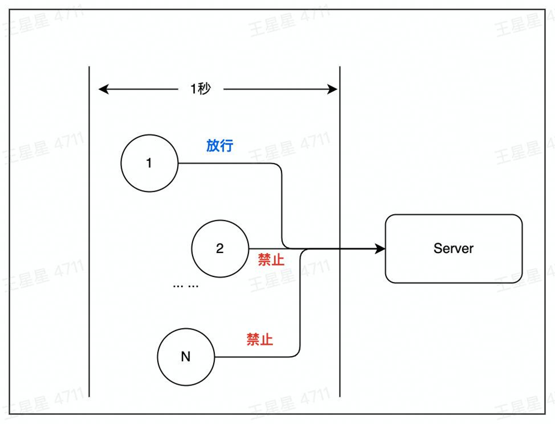

### 01 Redis是什么

#### 为什么需要Redis

数据库从单表演进出了分库分表，MySQL 从单机演进出了集群模式，主要原因是数据的增长与读写的压力不断增加


这时需要一个内存型数据库，将热数据经常被访问的数据存放到内存中。

#### Redis 基本工作原理

- 数据从内存中读取
- 数据保存到硬盘中防止重启数据丢失
- 增量数据保存到AOF文件

- 全量数据RDB文件

- 单线程处理所有操作命令


### 02 Redis 应用案例
#### 1. 连续签到
- 需求：用户每日有一次签到机会，如果断签，连续签到计数归零。连续签到定义：每日必须在 23:59:59 前签到。

- key:cc_uuid_xxxxxxxx;
- value:201;
- expireAt:后天的0点

```golang
package example

import (
	"context"
	"fmt"
	"strconv"
	"time"
)

var ctx = context.Background()

const continuesCheckKey = "cc_uid_%d"

// Ex01 连续签到天数
func Ex01(ctx context.Context, params []string) {
	if userID, err := strconv.ParseInt(params[0], 10, 64); err == nil {
		addContinuesDays(ctx, userID)
	} else {
		fmt.Printf("参数错误, params=%v, error: %v\n", params, err)
	}
}

// addContinuesDays 为用户签到续期
func addContinuesDays(ctx context.Context, userID int64) {
	key := fmt.Sprintf(continuesCheckKey, userID)
	// 1. 连续签到数+1
	err := RedisClient.Incr(ctx, key).Err()
	if err != nil {
		fmt.Errorf("用户[%d]连续签到失败", userID)
	} else {
		expAt := beginningOfDay().Add(48 * time.Hour)
		// 2. 设置签到记录在后天的0点到期
		if err := RedisClient.ExpireAt(ctx, key, expAt).Err(); err != nil {
			panic(err)
		} else {
			// 3. 打印用户续签后的连续签到天数
			day, err := getUserCheckInDays(ctx, userID)
			if err != nil {
				panic(err)
			}
			fmt.Printf("用户[%d]连续签到：%d(天), 过期时间:%s", userID, day, expAt.Format("2006-01-02 15:04:05"))
		}
	}
}

// getUserCheckInDays 获取用户连续签到天数
func getUserCheckInDays(ctx context.Context, userID int64) (int64, error) {
	key := fmt.Sprintf(continuesCheckKey, userID)
	days, err := RedisClient.Get(ctx, key).Result()
	if err != nil {
		return 0, err
	}
	if daysInt, err := strconv.ParseInt(days, 10, 64); err != nil {
		panic(err)
	} else {
		return daysInt, nil
	}
}

// beginningOfDay 获取今天0点时间
func beginningOfDay() time.Time {
	now := time.Now()
	y, m, d := now.Date()
	return time.Date(y, m, d, 0, 0, 0, 0, time.Local)
}
```

String 数据结构
> 数据结构：sds


- 可存储字符串、数字、二进制数据
- 通常配合expire使用
- 场景：存储计数、session

#### 2. 消息通知
> 使用 list 作为消息队列


- 使用场景：消息通知
例如文章更新时，将更新后的文章推送到ES，用户就能搜到最新的文章数据

```golang
package example

import (
	"context"
	"fmt"
	"strings"
	"time"

	"gitee.com/wedone/redis_course/example/common"
)

const ex04ListenList = "ex04_list_0" // lpush ex04_list_0 AA BB

// Ex04Params Ex04的自定义函数
type Ex04Params struct {
}

func Ex04(ctx context.Context) {
	eventLogger := &common.ConcurrentEventLogger{}
	// new一个并发执行器
	// routineNums是消费端的数量，多消费的场景，可以使用ex04ConsumerPop，使用ex04ConsumerRange存在消息重复消费的问题。
	cInst := common.NewConcurrentRoutine(1, eventLogger)
	// 并发执行用户自定义函数work
	cInst.Run(ctx, Ex04Params{}, ex04ConsumerPop)
	// 按日志时间正序打印日志
	eventLogger.PrintLogs()
}

// ex04ConsumerPop 使用rpop逐条消费队列中的信息，数据从队列中移除
// 生成端使用：lpush ex04_list_0 AA BB
func ex04ConsumerPop(ctx context.Context, cInstParam common.CInstParams) {
	routine := cInstParam.Routine
	for {
		items, err := RedisClient.BRPop(ctx, 0, ex04ListenList).Result()
		if err != nil {
			panic(err)
		}
		fmt.Println(common.LogFormat(routine, "读取文章[%s]标题、正文，发送到ES更新索引", items[1]))
		// 将文章内容推送到ES
		time.Sleep(1 * time.Second)
	}
}

// ex04ConsumerRange 使用lrange批量消费队列中的数据，数据保留在队列中
// 生成端使用：rpush ex04_list_0 AA BB
// 消费端：
// 方法1 lrange ex04_list_0 -3 -1 // 从FIFO队尾中一次消费3条信息
// 方法2 rpop ex04_list_0 3
func ex04ConsumerRange(ctx context.Context, cInstParam common.CInstParams) {
	routine := cInstParam.Routine
	consumeBatchSize := int64(3) // 一次取N个消息
	for {
		// 从index(-consumeBatchSize)开始取，直到最后一个元素index(-1)
		items, err := RedisClient.LRange(ctx, ex04ListenList, -consumeBatchSize, -1).Result()
		if err != nil {
			panic(err)
		}
		if len(items) > 0 {
			fmt.Println(common.LogFormat(routine, "收到信息:%s", strings.Join(items, "->")))
			// 清除已消费的队列
			// 方法1 使用LTrim
			// 保留从index(0)开始到index(-(consumeBatchSize + 1))的部分，即为未消费的部分
			// RedisClient.LTrim(ctx, ex04ListenList, 0, -(consumeBatchSize + 1))

			// 方法2 使用RPop
			RedisClient.RPopCount(ctx, ex04ListenList, int(consumeBatchSize))
		}
		time.Sleep(3 * time.Second)
	}
}
```

- list 数据结构：QuickList
QuickList 使用一个双向链表和listpack实现


- listpack 数据结构


#### 3. 计数
- 一个用户有多项计数需求可通过 hash 结构存储

user_count_xxxxx

|key|value|desc|
|---|---|---|
|count1|1|点赞数|
|count2|1|关注数|
|---|---|---|

```golang
package example

import (
	"context"
	"fmt"
	"os"
	"strconv"

	"github.com/go-redis/redis/v9"
)

const Ex05UserCountKey = "ex05_user_count"

// Ex05 hash数据结果的运用（参考掘金应用）
// go run main.go init 初始化用户计数值
// go run main.go get 1556564194374926  // 打印用户(1556564194374926)的所有计数值
// go run main.go incr_like 1556564194374926 // 点赞数+1
// go run main.go incr_collect 1556564194374926 // 点赞数+1
// go run main.go decr_like 1556564194374926 // 点赞数-1
// go run main.go decr_collect 1556564194374926 // 点赞数-1
func Ex05(ctx context.Context, args []string) {
	if len(args) == 0 {
		fmt.Printf("args can NOT be empty\n")
		os.Exit(1)
	}
	arg1 := args[0]
	switch arg1 {
	case "init":
		Ex06InitUserCounter(ctx)
	case "get":
		userID, err := strconv.ParseInt(args[1], 10, 64)
		if err != nil {
			panic(err)
		}
		GetUserCounter(ctx, userID)
	case "incr_like":
		userID, err := strconv.ParseInt(args[1], 10, 64)
		if err != nil {
			panic(err)
		}
		IncrByUserLike(ctx, userID)
	case "incr_collect":
		userID, err := strconv.ParseInt(args[1], 10, 64)
		if err != nil {
			panic(err)
		}
		IncrByUserCollect(ctx, userID)
	case "decr_like":
		userID, err := strconv.ParseInt(args[1], 10, 64)
		if err != nil {
			panic(err)
		}
		DecrByUserLike(ctx, userID)
	case "decr_collect":
		userID, err := strconv.ParseInt(args[1], 10, 64)
		if err != nil {
			panic(err)
		}
		DecrByUserCollect(ctx, userID)
	}

}

func Ex06InitUserCounter(ctx context.Context) {
	pipe := RedisClient.Pipeline()
	userCounters := []map[string]interface{}{
		{"user_id": "1556564194374926", "got_digg_count": 10693, "got_view_count": 2238438, "followee_count": 176, "follower_count": 9895, "follow_collect_set_count": 0, "subscribe_tag_count": 95},
		{"user_id": "1111", "got_digg_count": 19, "got_view_count": 4},
		{"user_id": "2222", "got_digg_count": 1238, "follower_count": 379},
	}
	for _, counter := range userCounters {
		uid, err := strconv.ParseInt(counter["user_id"].(string), 10, 64)
		key := GetUserCounterKey(uid)
		rw, err := pipe.Del(ctx, key).Result()
		if err != nil {
			fmt.Printf("del %s, rw=%d\n", key, rw)
		}
		_, err = pipe.HMSet(ctx, key, counter).Result()
		if err != nil {
			panic(err)
		}

		fmt.Printf("设置 uid=%d, key=%s\n", uid, key)
	}
	// 批量执行上面for循环设置好的hmset命令
	_, err := pipe.Exec(ctx)
	if err != nil { // 报错后进行一次额外尝试
		_, err = pipe.Exec(ctx)
		if err != nil {
			panic(err)
		}
	}
}

func GetUserCounterKey(userID int64) string {
	return fmt.Sprintf("%s_%d", Ex05UserCountKey, userID)
}

func GetUserCounter(ctx context.Context, userID int64) {
	pipe := RedisClient.Pipeline()
	GetUserCounterKey(userID)
	pipe.HGetAll(ctx, GetUserCounterKey(userID))
	cmders, err := pipe.Exec(ctx)
	if err != nil {
		panic(err)
	}
	for _, cmder := range cmders {
		counterMap, err := cmder.(*redis.MapStringStringCmd).Result()
		if err != nil {
			panic(err)
		}
		for field, value := range counterMap {
			fmt.Printf("%s: %s\n", field, value)
		}
	}
}

// IncrByUserLike 点赞数+1
func IncrByUserLike(ctx context.Context, userID int64) {
	incrByUserField(ctx, userID, "got_digg_count")
}

// IncrByUserCollect 收藏数+1
func IncrByUserCollect(ctx context.Context, userID int64) {
	incrByUserField(ctx, userID, "follow_collect_set_count")
}

// DecrByUserLike 点赞数-1
func DecrByUserLike(ctx context.Context, userID int64) {
	decrByUserField(ctx, userID, "got_digg_count")
}

// DecrByUserCollect 收藏数-1
func DecrByUserCollect(ctx context.Context, userID int64) {
	decrByUserField(ctx, userID, "follow_collect_set_count")
}

func incrByUserField(ctx context.Context, userID int64, field string) {
	change(ctx, userID, field, 1)
}

func decrByUserField(ctx context.Context, userID int64, field string) {
	change(ctx, userID, field, -1)
}

func change(ctx context.Context, userID int64, field string, incr int64) {
	redisKey := GetUserCounterKey(userID)
	before, err := RedisClient.HGet(ctx, redisKey, field).Result()
	if err != nil {
		panic(err)
	}
	beforeInt, err := strconv.ParseInt(before, 10, 64)
	if err != nil {
		panic(err)
	}
	if beforeInt+incr < 0 {
		fmt.Printf("禁止变更计数，计数变更后小于0. %d + (%d) = %d\n", beforeInt, incr, beforeInt+incr)
		return
	}
	fmt.Printf("user_id: %d\n更新前\n%s = %s\n--------\n", userID, field, before)
	_, err = RedisClient.HIncrBy(ctx, redisKey, field, incr).Result()
	if err != nil {
		panic(err)
	}
	// fmt.Printf("更新记录[%d]:%d\n", userID, num)
	count, err := RedisClient.HGet(ctx, redisKey, field).Result()
	if err != nil {
		panic(err)
	}
	fmt.Printf("user_id: %d\n更新后\n%s = %s\n--------\n", userID, field, count)
}
```

- hash 数据结构 dict

- rehash：rehash操作是将ht[0]中的数据，全部迁移到ht[1]中。数据量小的场景下，直接将数据从ht[0]拷贝到ht[1]速度是较快的。数据量大的场景，例如存有上百万的KV时，迁移过程将会明显阻塞用户请求。
- 渐进式rehash：为避免出现这种情况，使用了rehash方案。基本原理就是，每次用户访问时都会迁移少量数据。将整个迁移过程，平摊到所有的访问用不请求过程中。


#### 4. 排行榜

> 积分变化时，排名需要变更

- 结合 dict 后，可实现通过 key 操作跳表的功能

```bash
zrangebyscore ex06_rank_zset 0 1000 withscores
zrevrange ex06_rank_zset 0 100 withscores
```


```golang
package example

import (
	"context"
	"fmt"
	"strconv"
	"time"

	"github.com/go-redis/redis/v9"
)

const Ex06RankKey = "ex06_rank_zset"

type Ex06ItemScore struct {
	ItemNam string
	Score   float64
}

// Ex06 排行榜
// go run main.go init // 初始化积分
// go run main.go Ex06 rev_order // 输出完整榜单
// go run main.go  Ex06 order_page 0 // 逆序分页输出，offset=1
// go run main.go  Ex06 get_rank user2 // 获取user2的排名
// go run main.go  Ex06 get_score user2 // 获取user2的分数
// go run main.go  Ex06 add_user_score user2 10 // 为user2设置为10分
// zadd ex06_rank_zset 15 andy
// zincrby ex06_rank_zset -9 andy // andy 扣9分，排名掉到最后一名
func Ex06(ctx context.Context, args []string) {
	arg1 := args[0]
	switch arg1 {
	case "init":
		Ex06InitUserScore(ctx)
	case "rev_order":
		GetRevOrderAllList(ctx, 0, -1)
	case "order_page":
		pageSize := int64(2)
		if len(args[1]) > 0 {
			offset, err := strconv.ParseInt(args[1], 10, 64)
			if err != nil {
				panic(err)
			}
			GetOrderListByPage(ctx, offset, pageSize)
		}
	case "get_rank":
		GetUserRankByName(ctx, args[1])
	case "get_score":
		GetUserScoreByName(ctx, args[1])
	case "add_user_score":
		if len(args) < 3 {
			fmt.Printf("参数错误，可能是缺少需要增加的分值。eg：go run main.go  Ex06 add_user_score user2 10\n")
			return
		}
		score, err := strconv.ParseFloat(args[2], 64)
		if err != nil {
			panic(err)
		}
		AddUserScore(ctx, args[1], score)
	}
	return
}

func Ex06InitUserScore(ctx context.Context) {
	initList := []redis.Z{
		{Member: "user1", Score: 10}, {Member: "user2", Score: 232}, {Member: "user3", Score: 129},
		{Member: "user4", Score: 232},
	}
	// 清空榜单
	if err := RedisClient.Del(ctx, Ex06RankKey).Err(); err != nil {
		panic(err)
	}

	nums, err := RedisClient.ZAdd(ctx, Ex06RankKey, initList...).Result()
	if err != nil {
		panic(err)
	}

	fmt.Printf("初始化榜单Item数量:%d\n", nums)
}

// 榜单逆序输出
// ZRANGE ex06_rank_zset +inf -inf BYSCORE  rev WITHSCORES
// 正序输出
// ZRANGE ex06_rank_zset 0 -1 WITHSCORES
func GetRevOrderAllList(ctx context.Context, limit, offset int64) {
	resList, err := RedisClient.ZRevRangeWithScores(ctx, Ex06RankKey, 0, -1).Result()
	if err != nil {
		panic(err)
	}
	fmt.Printf("\n榜单:\n")
	for i, z := range resList {
		fmt.Printf("第%d名 %s\t%f\n", i+1, z.Member, z.Score)
	}
}

func GetOrderListByPage(ctx context.Context, offset, pageSize int64) {
	// zrange ex06_rank_zset 300 0 byscore rev limit 1 2 withscores // 取300分到0分之间的排名
	// zrange ex06_rank_zset -inf +inf byscore withscores 正序输出
	// ZRANGE ex06_rank_zset +inf -inf BYSCORE  REV WITHSCORES 逆序输出所有排名
	// zrange ex06_rank_zset +inf -inf byscore rev limit 0 2 withscores 逆序分页输出排名
	zRangeArgs := redis.ZRangeArgs{
		Key:     Ex06RankKey,
		ByScore: true,
		Rev:     true,
		Start:   "-inf",
		Stop:    "+inf",
		Offset:  offset,
		Count:   pageSize,
	}
	resList, err := RedisClient.ZRangeArgsWithScores(ctx, zRangeArgs).Result()
	if err != nil {
		panic(err)
	}
	fmt.Printf("\n榜单(offest=%d, pageSize=%d):\n", offset, pageSize)
	offNum := int(pageSize * offset)
	for i, z := range resList {
		rank := i + 1 + offNum
		fmt.Printf("第%d名 %s\t%f\n", rank, z.Member, z.Score)
	}
	fmt.Println()
}

// GetUserRankByName 获取用户排名
func GetUserRankByName(ctx context.Context, name string) {
	rank, err := RedisClient.ZRevRank(ctx, Ex06RankKey, name).Result()
	if err != nil {
		fmt.Errorf("error getting name=%s, err=%v", name, err)
		return
	}
	fmt.Printf("name=%s, 排名=%d\n", name, rank+1)
}

// GetUserScoreByName 获取用户分值
func GetUserScoreByName(ctx context.Context, name string) {
	score, err := RedisClient.ZScore(ctx, Ex06RankKey, name).Result()
	if err != nil {
		fmt.Errorf("error getting name=%s, err=%v", name, err)
		return
	}
	fmt.Println(time.Now().UnixMilli())
	fmt.Printf("name=%s, 分数=%f\n", name, score)
}

// AddUserScore 排名用户
func AddUserScore(ctx context.Context, name string, score float64) {
	num, err := RedisClient.ZIncrBy(ctx, Ex06RankKey, score, name).Result()
	if err != nil {
		panic(err)
	}
	fmt.Printf("name=%s, add_score=%f, score=%f\n", name, score, num)
}
```
- zset 数据结构 zskiplist


- 查找数字7的路径： head->3->3->7
- 结合dict后可实现，可实现通过 key 操作跳表的功能


#### 5. 限流
- 需求：要求1秒内放行的请求为N，超过N则禁止访问
- key:comment_limit_xxxx
- 对这个 key 进行 incr 操作，超过则限制访问
- xxxxx 是时间戳


```golang
package example

import (
	"context"
	"fmt"
	"sync/atomic"
	"time"

	"github.com/go-redis/redis/v9"

	"gitee.com/wedone/redis_course/example/common"
)

type Ex03Params struct {
}

var ex03LimitKeyPrefix = "comment_freq_limit"
var accessQueryNum = int32(0)

const ex03MaxQPS = 10 // 限流次数

// ex03LimitKey 返回key格式为：comment_freq_limit-1669524458 // 用来记录这1秒内的请求数量
func ex03LimitKey(currentTimeStamp time.Time) string {
	return fmt.Sprintf("%s-%d", ex03LimitKeyPrefix, currentTimeStamp.Unix())
}

// Ex03 简单限流
func Ex03(ctx context.Context) {
	eventLogger := &common.ConcurrentEventLogger{}
	// new一个并发执行器
	cInst := common.NewConcurrentRoutine(500, eventLogger)
	// 并发执行用户自定义函数work
	cInst.Run(ctx, Ex03Params{}, ex03Work)
	// 按日志时间正序打印日志
	eventLogger.PrintLogs()
	fmt.Printf("放行总数：%d\n", accessQueryNum)

	fmt.Printf("\n------\n下一秒请求\n------\n")
	accessQueryNum = 0
	time.Sleep(1 * time.Second)
	// new一个并发执行器
	cInst = common.NewConcurrentRoutine(10, eventLogger)
	// 并发执行用户自定义函数work
	cInst.Run(ctx, Ex03Params{}, ex03Work)
	// 按日志时间正序打印日志
	eventLogger.PrintLogs()
	fmt.Printf("放行总数：%d\n", accessQueryNum)
}

func ex03Work(ctx context.Context, cInstParam common.CInstParams) {
	routine := cInstParam.Routine
	eventLogger := cInstParam.ConcurrentEventLogger
	key := ex03LimitKey(time.Now())
	currentQPS, err := RedisClient.Incr(ctx, key).Result()
	if err != nil || err == redis.Nil {
		err = RedisClient.Incr(ctx, ex03LimitKey(time.Now())).Err()
		if err != nil {
			panic(err)
		}
	}
	if currentQPS > ex03MaxQPS {
		// 超过流量限制，请求被限制
		eventLogger.Append(common.EventLog{
			EventTime: time.Now(),
			Log:       common.LogFormat(routine, "被限流[%d]", currentQPS),
		})
		// sleep 模拟业务逻辑耗时
		time.Sleep(50 * time.Millisecond)
		err = RedisClient.Decr(ctx, key).Err()
		if err != nil {
			panic(err)
		}
	} else {
		// 流量放行
		eventLogger.Append(common.EventLog{
			EventTime: time.Now(),
			Log:       common.LogFormat(routine, "流量放行[%d]", currentQPS),
		})
		atomic.AddInt32(&accessQueryNum, 1)
		time.Sleep(20 * time.Millisecond)
	}
}
```
#### 6. 分布式锁
- 并发场景下，要求有且只有一个协程执行，执行完成后，其他等待中的协程才能执行

可以使用 Redis 的 setnx 实现，利用这两个特性
- Redis 是单线程执行命令
- setnx 只有未设置过才能执行成功


```golang
package example

// setnx 分布式锁
import (
	"context"
	"fmt"
	"strconv"
	"time"

	"gitee.com/wedone/redis_course/example/common"
)

const resourceKey = "syncKey"      // 分布式锁的key
const exp = 800 * time.Millisecond // 锁的过期时间，避免死锁

// EventLog 搜集日志的结构
type EventLog struct {
	eventTime time.Time
	log       string
}

// Ex02Params Ex02的自定义函数
type Ex02Params struct {
}

// Ex02 只是体验SetNX的特性，不是高可用的分布式锁实现
// 该实现存在的问题:
// (1) 业务超时解锁，导致并发问题。业务执行时间超过锁超时时间
// (2) redis主备切换临界点问题。主备切换后，A持有的锁还未同步到新的主节点时，B可在新主节点获取锁，导致并发问题。
// (3) redis集群脑裂，导致出现多个主节点
func Ex02(ctx context.Context) {
	eventLogger := &common.ConcurrentEventLogger{}
	// new一个并发执行器
	cInst := common.NewConcurrentRoutine(10, eventLogger)
	// 并发执行用户自定义函数work
	cInst.Run(ctx, Ex02Params{}, ex02Work)
	// 按日志时间正序打印日志
	eventLogger.PrintLogs()
}

func ex02Work(ctx context.Context, cInstParam common.CInstParams) {
	routine := cInstParam.Routine
	eventLogger := cInstParam.ConcurrentEventLogger
	defer ex02ReleaseLock(ctx, routine, eventLogger)
	for {
		// 1. 尝试获取锁
		// exp - 锁过期设置,避免异常死锁
		acquired, err := RedisClient.SetNX(ctx, resourceKey, routine, exp).Result() // 尝试获取锁
		if err != nil {
			eventLogger.Append(common.EventLog{
				EventTime: time.Now(), Log: fmt.Sprintf("[%s] error routine[%d], %v", time.Now().Format(time.RFC3339Nano), routine, err),
			})
			panic(err)
		}
		if acquired {
			// 2. 成功获取锁
			eventLogger.Append(common.EventLog{
				EventTime: time.Now(), Log: fmt.Sprintf("[%s] routine[%d] 获取锁", time.Now().Format(time.RFC3339Nano), routine),
			})
			// 3. sleep 模拟业务逻辑耗时
			time.Sleep(10 * time.Millisecond)
			eventLogger.Append(common.EventLog{
				EventTime: time.Now(), Log: fmt.Sprintf("[%s] routine[%d] 完成业务逻辑", time.Now().Format(time.RFC3339Nano), routine),
			})
			return
		} else {
			// 没有获得锁，等待后重试
			time.Sleep(100 * time.Millisecond)
		}
	}
}

func ex02ReleaseLock(ctx context.Context, routine int, eventLogger *common.ConcurrentEventLogger) {
	routineMark, _ := RedisClient.Get(ctx, resourceKey).Result()
	if strconv.FormatInt(int64(routine), 10) != routineMark {
		// 其它协程误删lock
		panic(fmt.Sprintf("del err lock[%s] can not del by [%d]", routineMark, routine))
	}
	set, err := RedisClient.Del(ctx, resourceKey).Result()
	if set == 1 {
		eventLogger.Append(common.EventLog{
			EventTime: time.Now(), Log: fmt.Sprintf("[%s] routine[%d] 释放锁", time.Now().Format(time.RFC3339Nano), routine),
		})
	} else {
		eventLogger.Append(common.EventLog{
			EventTime: time.Now(), Log: fmt.Sprintf("[%s] routine[%d] no lock to del", time.Now().Format(time.RFC3339Nano), routine),
		})
	}
	if err != nil {
		fmt.Errorf("[%s] error routine=%d, %v", time.Now().Format(time.RFC3339Nano), routine, err)
		panic(err)
	}
}
```

### 03 Redis 使用注意事项

#### 大key/热key

大 key 的定义

|数据类型|大 key 定义|
|---|---|
|String类型|value 的字节数大于 10KB 即为大key|
|Hash/Set/Zset/list 复杂数据结构|元素大于 5000 个，或 value 字节数大于 10MB 即为大key|

大 key 的危害
- 读取成本高
- 容易导致慢查询（过期、删除）
- 主从复制异常，服务阻塞无法正常请求

业务侧使用大 key 的表现
- 请求 Redis 超时报错

消除大 key 的办法
1. 拆分，将大 key 拆分为小 key，例如将1个 String 拆成多个 String。

||key|value|
|---|---|---|
|拆分前|artcle:001|abcdcbddddd|
|拆分后|artcle:001|[3][001]abcd|
|      |artcle:001_2|[001]cbddd|
|      |artcle:001_3|[001]ddddd|
2. 压缩：

将value压缩后写入redis，读取时解压后再使用。压缩算法可以是gzip、snappy、lz4等。通常情况下，一个压缩算法压缩率高、则解压耗时就长。需要对实际数据进行测试后，选择一个合适的算法。如果存储的是JSON字符串，可以考虑使用MessagePack进行序列化。

3. 集合类数据结构：hash、list、set、zset
    1. 拆分：可以使用 hash 取余、位掩码的方式决定放哪个 key 中
    2. 区分冷热：如榜单场景使用 Zset，只缓存前10页数据，后续数据走DB

热 key 的定义

用户访问一个 key 的 QPS 特别高，导致 Server 实例出现 CPU 负载突增或者不均的情况。
热 key 没有明确的标准， QPS 超过 500 就有可能被识别为热 key。


解决热 key 的方法

1. 设置 LocalCache

在访问 Redis 前，在业务服务侧设置 LocalCache，降低 Redis 的 QPS。LocalCache 中缓存过期或未命中，则从 Redis 中将数据更新到 LocalCache。Java 的 Guava、Golang 的 BigCache 就是这类 LocalCache。


2. 拆分

将key:value这一个热Key复制写入多份，例如key1:value,key2:value，访问的时候访问多个key，但value是同一个，以此将qps分散到不同实例上，降低负载。代价是，更新时需要更新多个key，存在数据短暂不一致的风险


3. 使用Redis代理的热Key承载能力

字节跳动的Redis访问代理就具备热Key承载能力。本质上是结合了“热Key发现”、“LocalCache”两个功能

#### 慢查询场景

##### 容易导致 Redis 慢查询的操作

1. 批量操作一次性传入过多的key/value，如mset/hmset/sadd/zadd等O(n)操作
      建议单批次不要超过100，超过100之后性能下降明显。
2.  zset大部分命令都是O(log(n))，当大小超过5k以上时，简单的zadd/zrem也可能导致慢查询 
3. 操作的单个value过大，超过10KB。也即，避免使用大Key
4. 对大key的delete/expire操作也可能导致慢查询，Redis4.0之前不支持异步删除unlink，大key删除会阻塞Redis

#### 缓存穿透/缓存雪崩

- 缓存穿透：热点数据查询绕过缓存，直接查询数据库
- 缓存雪崩：大量缓存同时过期

缓存穿透的危害
1. 查询一个一定不存在的数据
     通常不会缓存不存在的数据，这类查询请求都会直接打到db，如果有系统bug或人为攻击，
     那么容易导致db响应慢甚至宕机
2. 缓存过期时 
     在高并发场景下，一个热key如果过期，会有大量请求同时击穿至db，容易影响db性能和稳定。
     同一时间有大量key集中过期时，也会导致大量请求落到db上，导致查询变慢，甚至出现db无法响应新的查询

如何减少缓存穿透

1. 缓存空值
    如一个不存在的userID。这个id在缓存和数据库中都不存在。则可以缓存一个空值，下次再查缓存直接反空值。
2. 布隆过滤器
     通过bloom filter算法来存储合法Key，得益于该算法超高的压缩率，只需占用极小的空间就能存储大量key值

如何减少缓存雪崩

1. 缓存空值
    将缓存失效时间分散开，比如在原有的失效时间基础上增加一个随机值，例如不同Key过期时间，
    可以设置为 10分1秒过期，10分23秒过期，10分8秒过期。单位秒部分就是随机时间，这样过期时间就分散了。
    对于热点数据，过期时间尽量设置得长一些，冷门的数据可以相对设置过期时间短一些。
2. 使用缓存集群，避免单机宕机造成的缓存雪崩。

### 参考文献

PPT 链接：https://bytedance.feishu.cn/file/TcbGb6isWoTKbLxCaqfc77Qqnee
DEMO 仓库：https://gitee.com/wedone/redis_course